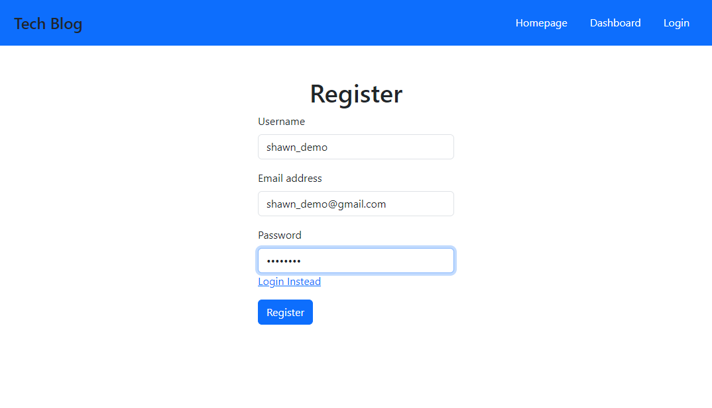
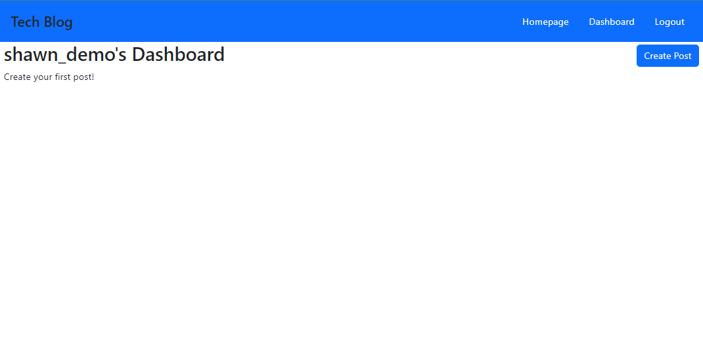
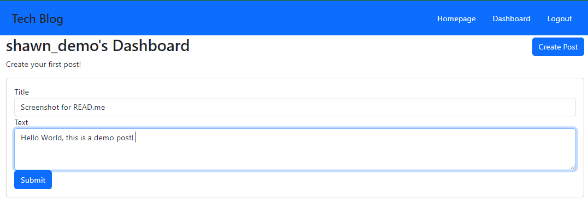
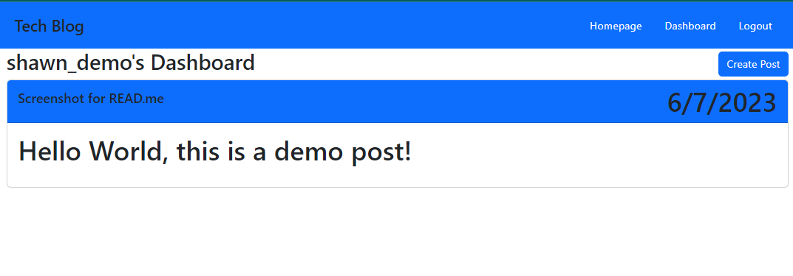
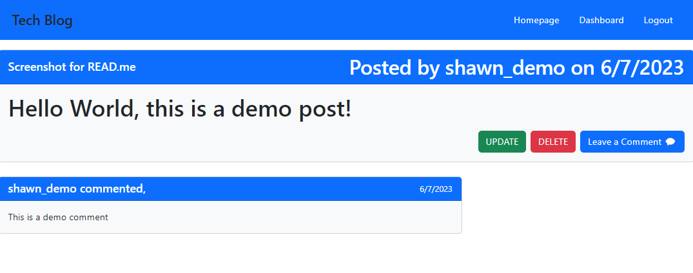

# 14 Model-View-Controller (MVC): Tech Blog

## Task 

This Tech Blog site needs to be built completely from scratch.

## Description

Tech Blog is a CMS-style blog site where developers can publish their blog posts and comment on other developers' posts. 
The application follows the Model-View-Controller (MVC) paradigm and utilizes Handlebars.js as the templating language, 
Sequelize as the ORM (Object-Relational Mapping) tool for database management, and the express-session npm package for authentication.

## Technologies Used

- Node.js
- Express.js
- MySQL
- Sequelize
- Handlebars.js
- express-session

## Usage

1. Clone the repository.
2. Install the dependencies by running the following command in the terminal: "npm i"
3. Set up the database by executing the provided SQL schema in MySQL Workbench or any other MySQL client.
4. Create a `.env` file in the root directory and add the following environment variables: *see .env.EXAMPLE*
5. Start the application by running: "node server.js"
6. Access the application in your browser at `http://localhost:3001`.

## Deployed Application

The application is deployed on Heroku. You can access it at [Tech Blog](https://tech-blog-060523.herokuapp.com/).

## Contributions

Contributions to the project are welcome. If you would like to contribute, please follow these steps:

1. Fork the repository.
2. Create a new branch for your feature or bug fix.
3. Make the necessary modifications.
4. Submit a pull request.

## Questions

If you have any questions, feel free to reach out on LinkedIn 

## Screenshots

 

 

 

 

 
